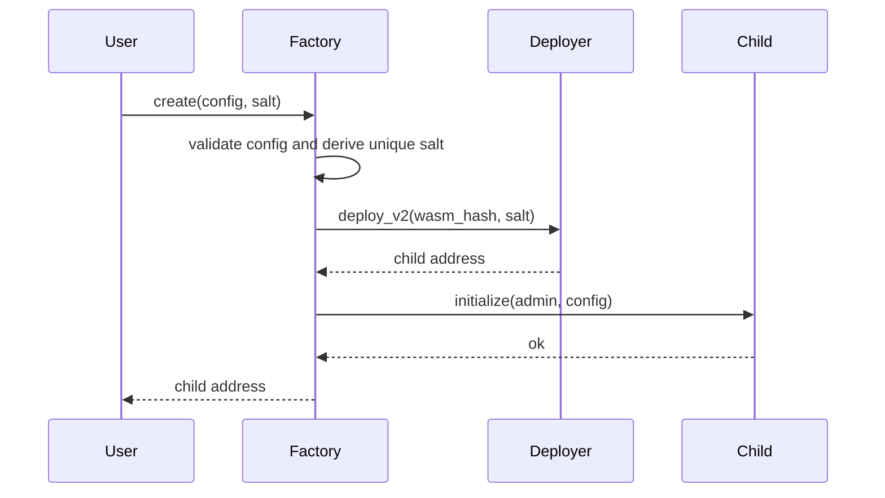
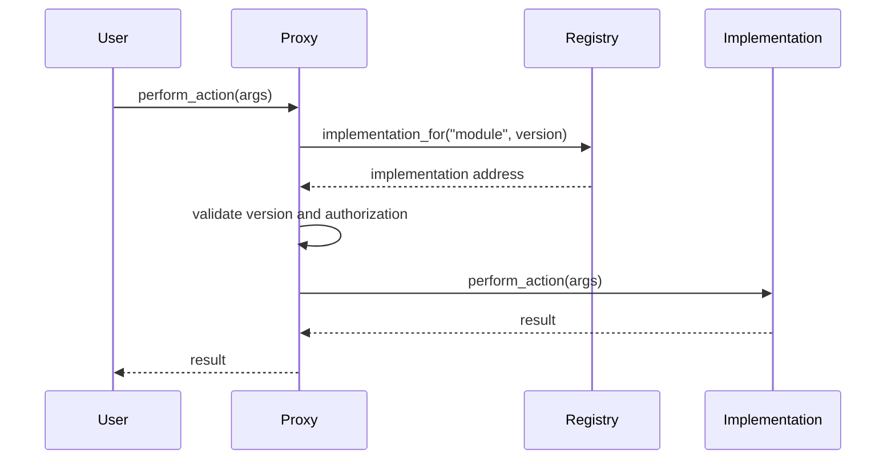
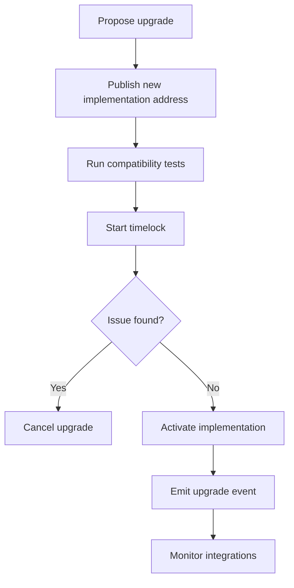
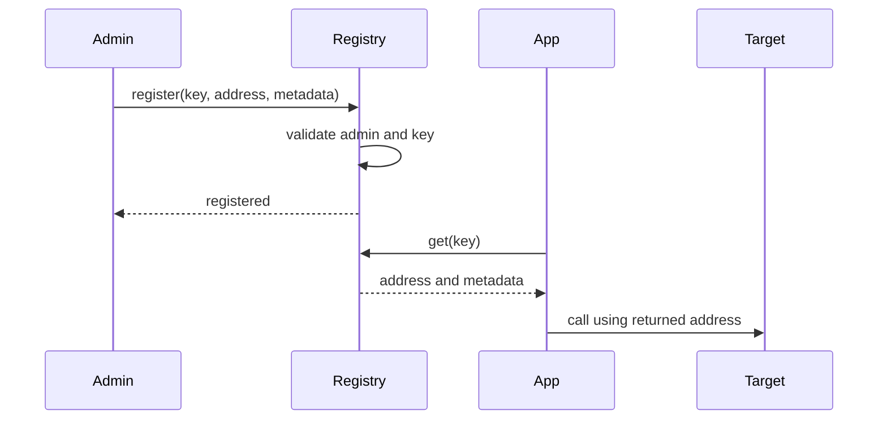

# Factory, Proxy, and Registry Patterns

Cross-contract systems let small contracts compose into larger products, but
they also create new failure modes. This guide explains three common
architecture patterns for Soroban applications: factories, proxies, and
registries.

Use these patterns when one contract needs to deploy, locate, route to, or
coordinate with other contracts.

## Pattern Overview

| Pattern | Use It For | Main Risk |
|---------|------------|-----------|
| Factory | Creating many similar contract instances | Uninitialized child contracts |
| Proxy | Routing calls through a stable address | Unsafe upgrades or storage mismatch |
| Registry | Discovering approved contract addresses | Stale or malicious registrations |

## Factory Pattern

A factory contract deploys and initializes child contracts from a known Wasm
hash. It is useful for vaults, pools, group savings contracts, and other
systems where users create many instances of the same template.

### Factory Checklist

- Store the child Wasm hash in instance storage and protect updates with admin
  or governance authorization.
- Derive salts from stable inputs such as creator address, nonce, and template
  version.
- Initialize the child in the same transaction that deploys it.
- Emit an event with the child address, creator, template version, and config
  hash.
- Keep a registry or index if users need to find their created contracts later.

### Factory Pitfalls

- Do not deploy a child and leave initialization to a separate user call.
- Do not let callers choose arbitrary Wasm hashes unless the factory is
  explicitly permissionless and the UI labels that risk.
- Do not reuse salts unless deterministic address reuse is intentional and
  fully documented.

## Proxy Pattern

A proxy provides a stable address while delegating behavior to another
contract or dispatching calls to versioned implementations. Soroban contracts
are immutable after deployment, so proxy-style designs usually mean explicit
routing, migration, or adapter contracts rather than EVM-style delegatecall.

### Proxy Variants

- **Router proxy:** forwards specific calls to registered modules.
- **Adapter proxy:** normalizes interfaces between old and new contracts.
- **Migration proxy:** keeps a stable entry point while users migrate state to
  a new contract.

### Upgrade Safety Notes

- Treat every upgrade as a protocol change, not a code patch.
- Keep storage ownership clear. A proxy should not assume it can read or write
  another contract's internal storage.
- Version implementation addresses and keep old implementations available until
  users and integrations have migrated.
- Require admin, multisig, or governance authorization for implementation
  changes.
- Consider a timelock for upgrades that affect funds, permissions, or pricing.
- Emit upgrade events with old address, new address, version, and activation
  ledger.
- Provide a rollback plan before activating the new implementation.

## Registry Pattern

A registry maps names, roles, modules, or asset identifiers to contract
addresses and metadata. Registries are the glue for wallets, factories,
routers, vaults, and cross-contract apps.

### Registry Design Tips

- Use typed keys instead of raw strings where possible.
- Store metadata that helps callers validate intent, such as version,
  interface name, network, and activation status.
- Distinguish active, deprecated, and blocked entries.
- Emit events for register, update, deactivate, and remove operations.
- Decide whether the registry is admin-controlled, governance-controlled, or
  permissionless before writing the storage model.

### Registry Pitfalls

- A registry is an allowlist only if callers enforce it.
- Stale entries can be worse than missing entries; include deactivation flows.
- Do not store display metadata as a substitute for validating contract
  behavior.

## Integration Tips

- Prefer small, explicit cross-contract interfaces over broad manager
  contracts.
- Validate every external address before calling it.
- Make authorization boundaries obvious: the caller authorizes the source
  contract, and the source contract chooses which downstream contracts to call.
- Use events as integration contracts for off-chain indexers.
- Avoid circular dependencies between contracts. If two contracts need each
  other, introduce a registry or shared configuration contract.
- Keep read batching separate from write batching when possible. Reads can be
  tolerant; writes should fail fast and leave no ambiguous partial state.
- Document every external contract address in deployment notes.

## Upgrade Safety Checklist

- [ ] New implementation address is registered with an explicit version.
- [ ] Storage ownership and migration rules are documented.
- [ ] Authorization for upgrade is enforced from stored config, not from a user
      supplied argument alone.
- [ ] A timelock or review period exists for high-value contracts.
- [ ] Integration tests cover old and new implementations.
- [ ] Events announce proposed and activated upgrades.
- [ ] Rollback or migration recovery path is documented.
- [ ] Off-chain services know which event topics and registry keys to watch.

## Choosing a Pattern

| Need | Recommended Pattern |
|------|---------------------|
| Create many instances from one template | Factory |
| Keep a stable entry point across versions | Proxy or adapter |
| Discover module or asset addresses | Registry |
| Create and discover child contracts | Factory plus registry |
| Upgrade an integration safely | Registry plus timelocked proxy |

## Related Examples

- [`examples/intermediate/ajo-factory`](../examples/intermediate/ajo-factory/)
  shows a factory deploying initialized child contracts.
- [`docs/common-patterns`](./common-patterns.md) covers lower-level building
  blocks such as initialization guards, stored-admin checks, typed storage keys,
  and events.
- [`docs/best-practices`](./best-practices.md) covers security and storage
  recommendations that apply to multi-contract systems.
