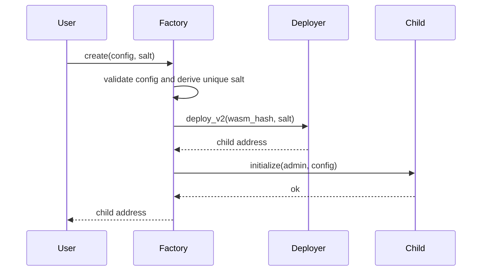
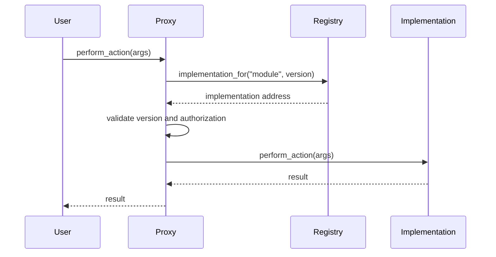
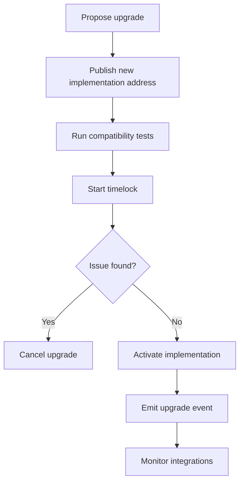
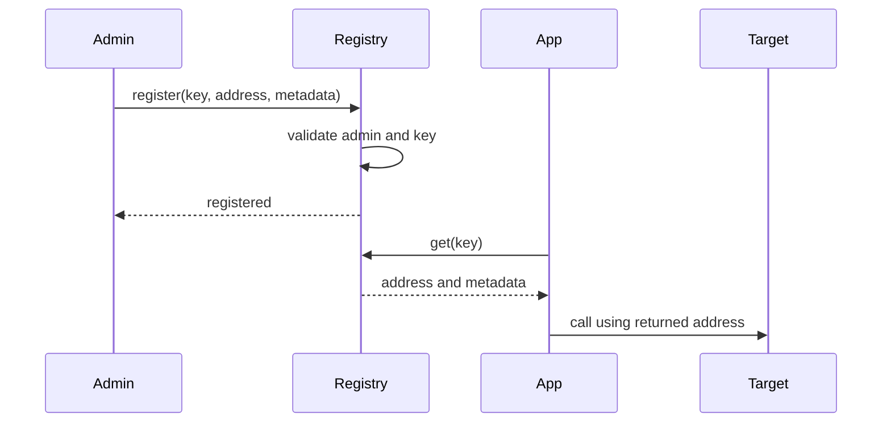

# Factory, Proxy, and Registry Patterns

Cross-contract systems let small contracts compose into larger products, but
they also create new failure modes. This guide explains three common
architecture patterns for Soroban applications: factories, proxies, and
registries.

Use these patterns when one contract needs to deploy, locate, route to, or
coordinate with other contracts.

## Pattern Overview

| Pattern | Use It For | Main Risk |
|---------|------------|-----------|
| Factory | Creating many similar contract instances | Uninitialized child contracts |
| Proxy | Routing calls through a stable address | Unsafe upgrades or storage mismatch |
| Registry | Discovering approved contract addresses | Stale or malicious registrations |

## Factory Pattern

A factory contract deploys and initializes child contracts from a known Wasm
hash. It is useful for vaults, pools, group savings contracts, and other
systems where users create many instances of the same template.

```mermaid
sequenceDiagram
    participant User
    participant Factory
    participant Deployer
    participant Child

    User->>Factory: create(config, salt)
    Factory->>Factory: validate config and derive unique salt
    Factory->>Deployer: deploy_v2(wasm_hash, salt)
    Deployer-->>Factory: child address
    Factory->>Child: initialize(admin, config)
    Child-->>Factory: ok
    Factory-->>User: child address
```

### Factory Checklist

- Store the child Wasm hash in instance storage and protect updates with admin
  or governance authorization.
- Derive salts from stable inputs such as creator address, nonce, and template
  version.
- Initialize the child in the same transaction that deploys it.
- Emit an event with the child address, creator, template version, and config
  hash.
- Keep a registry or index if users need to find their created contracts later.

### Factory Pitfalls

- Do not deploy a child and leave initialization to a separate user call.
- Do not let callers choose arbitrary Wasm hashes unless the factory is
  explicitly permissionless and the UI labels that risk.
- Do not reuse salts unless deterministic address reuse is intentional and
  fully documented.

## Proxy Pattern

A proxy provides a stable address while delegating behavior to another
contract or dispatching calls to versioned implementations. Soroban contracts
are immutable after deployment, so proxy-style designs usually mean explicit
routing, migration, or adapter contracts rather than EVM-style delegatecall.

```mermaid
sequenceDiagram
    participant User
    participant Proxy
    participant Registry
    participant Implementation

    User->>Proxy: perform_action(args)
    Proxy->>Registry: implementation_for("module", version)
    Registry-->>Proxy: implementation address
    Proxy->>Proxy: validate version and authorization
    Proxy->>Implementation: perform_action(args)
    Implementation-->>Proxy: result
    Proxy-->>User: result
```

### Proxy Variants

- **Router proxy:** forwards specific calls to registered modules.
- **Adapter proxy:** normalizes interfaces between old and new contracts.
- **Migration proxy:** keeps a stable entry point while users migrate state to
  a new contract.

### Upgrade Safety Notes

- Treat every upgrade as a protocol change, not a code patch.
- Keep storage ownership clear. A proxy should not assume it can read or write
  another contract's internal storage.
- Version implementation addresses and keep old implementations available until
  users and integrations have migrated.
- Require admin, multisig, or governance authorization for implementation
  changes.
- Consider a timelock for upgrades that affect funds, permissions, or pricing.
- Emit upgrade events with old address, new address, version, and activation
  ledger.
- Provide a rollback plan before activating the new implementation.

```mermaid
flowchart TD
    A[Propose upgrade] --> B[Publish new implementation address]
    B --> C[Run compatibility tests]
    C --> D[Start timelock]
    D --> E{Issue found?}
    E -- Yes --> F[Cancel upgrade]
    E -- No --> G[Activate implementation]
    G --> H[Emit upgrade event]
    H --> I[Monitor integrations]
```

## Registry Pattern

A registry maps names, roles, modules, or asset identifiers to contract
addresses and metadata. Registries are the glue for wallets, factories,
routers, vaults, and cross-contract apps.

```mermaid
sequenceDiagram
    participant Admin
    participant Registry
    participant App
    participant Target

    Admin->>Registry: register(key, address, metadata)
    Registry->>Registry: validate admin and key
    Registry-->>Admin: registered
    App->>Registry: get(key)
    Registry-->>App: address and metadata
    App->>Target: call using returned address
```

### Registry Design Tips

- Use typed keys instead of raw strings where possible.
- Store metadata that helps callers validate intent, such as version,
  interface name, network, and activation status.
- Distinguish active, deprecated, and blocked entries.
- Emit events for register, update, deactivate, and remove operations.
- Decide whether the registry is admin-controlled, governance-controlled, or
  permissionless before writing the storage model.

### Registry Pitfalls

- A registry is an allowlist only if callers enforce it.
- Stale entries can be worse than missing entries; include deactivation flows.
- Do not store display metadata as a substitute for validating contract
  behavior.

## Integration Tips

- Prefer small, explicit cross-contract interfaces over broad manager
  contracts.
- Validate every external address before calling it.
- Make authorization boundaries obvious: the caller authorizes the source
  contract, and the source contract chooses which downstream contracts to call.
- Use events as integration contracts for off-chain indexers.
- Avoid circular dependencies between contracts. If two contracts need each
  other, introduce a registry or shared configuration contract.
- Keep read batching separate from write batching when possible. Reads can be
  tolerant; writes should fail fast and leave no ambiguous partial state.
- Document every external contract address in deployment notes.

## Optimizing Cross-Contract Calls

Cross-contract calls dominate transaction cost in Soroban. Reduce overhead by
packing arguments, batching related calls, and minimizing round trips.

### Pack Arguments

- Encode multiple fields into one `Bytes` or `String` value instead of passing
  many small arguments.
- Use a single `Vec` or map when the callee needs a set of related values.
- For token transfers, follow SEP-41 and pass `Address` and `i128` values
  directly; do not wrap them in an extra envelope unless the callee requires
  it.

### Batch Calls

- Combine independent reads into one contract call that returns all requested
  values.
- Use factory or registry contracts to resolve addresses, then batch
  operations against child contracts in one transaction.
- If a workflow needs several writes, use one coordinator contract call that
  performs the writes sequentially; avoid forcing the caller to make multiple
  top-level transactions.

### Minimize Round Trips

- Prefer returning composite structs or `Vec`s over requiring many `get` calls.
- Cache registry lookups and implementation addresses locally when a
  transaction performs repeated calls to the same target.
- Validate arguments before the first call so a failing batch does not waste
  earlier work.

Measure gas before and after each optimization. Packing arguments usually
reduces calldata size, batching reduces ledger access overhead, and fewer round
trips reduce CPU and storage costs.

## Benchmarking Cross-Contract Calls

Cross-contract calls add ledger I/O, host function calls, and authentication
checks that do not appear in single-contract benchmarks. Measure them with the
integration test suite under `tests/integration/`, not with isolated contract
units, so the results include deployment, address resolution, and event
emission overheads. Add these benchmarks to the existing `integration-tests`
package by extending path dependencies in `tests/integration/Cargo.toml` and
following the cross-contract patterns in `integration_tests.rs`.

### Benchmark Checklist

- Measure call overhead by timing a direct contract call and the same call
  routed through a factory-deployed child, a proxy, and a registry lookup.
- Use factory deployment benchmarks to capture deploy cost, initialization
  cost, and the event cost of a single create transaction.
- Use proxy call benchmarks to capture routing, version validation, and
  implementation dispatch costs separately from business logic.
- Record results in a reproducible benchmark document or CI job, including the
  Soroban environment version, Wasm size, and storage footprint.

### Optimization Recommendations

- Remove external calls that can be replaced with a single read from a shared
  registry or configuration contract.
- Batch reads and writes inside one contract instead of making many small
  cross-contract calls.
- Keep proxies thin: any invariant checking that can be done by the caller or
  implementation should not be repeated in the routing layer.
- Reuse deployed child contracts through a registry when creation cost is the
  bottleneck, but make sure callers still validate the returned address.
- Document the expected gas and ledger cost per cross-contract action in the
  deployment notes so regressions are visible in code review.

## Upgrade Safety Checklist

- [ ] New implementation address is registered with an explicit version.
- [ ] Storage ownership and migration rules are documented.
- [ ] Authorization for upgrade is enforced from stored config, not from a user
      supplied argument alone.
- [ ] A timelock or review period exists for high-value contracts.
- [ ] Integration tests cover old and new implementations.
- [ ] Events announce proposed and activated upgrades.
- [ ] Rollback or migration recovery path is documented.
- [ ] Off-chain services know which event topics and registry keys to watch.

## Choosing a Pattern

| Need | Recommended Pattern |
|------|---------------------|
| Create many instances from one template | Factory |
| Keep a stable entry point across versions | Proxy or adapter |
| Discover module or asset addresses | Registry |
| Create and discover child contracts | Factory plus registry |
| Upgrade an integration safely | Registry plus timelocked proxy |

## Related Examples

- [`examples/intermediate/ajo-factory`](../examples/intermediate/ajo-factory/)
  shows a factory deploying initialized child contracts.
- [`examples/advanced/04-upgradeable-proxy`](../examples/advanced/04-upgradeable-proxy/)
  shows a stable entry point routing to a versioned implementation.
- [`examples/advanced/03-proxy-admin`](../examples/advanced/03-proxy-admin/)
  shows the governance side of the upgrade checklist above: admin-authenticated
  proposals, a timelock, and an emergency pause.
- [`examples/advanced/contract-registry`](../examples/advanced/contract-registry/)
  and [`examples/advanced/11-version-registry`](../examples/advanced/11-version-registry/)
  show address discovery and version history with rollback.
- [`examples/advanced/12-oracle-consumer`](../examples/advanced/12-oracle-consumer/)
  shows the caller side of a cross-contract integration: validating what another
  contract returns before acting on it.
- [`docs/common-patterns`](./common-patterns.md) covers lower-level building
  blocks such as initialization guards, stored-admin checks, typed storage keys,
  and events.
- [`docs/best-practices`](./best-practices.md) covers security and storage
  recommendations that apply to multi-contract systems.
