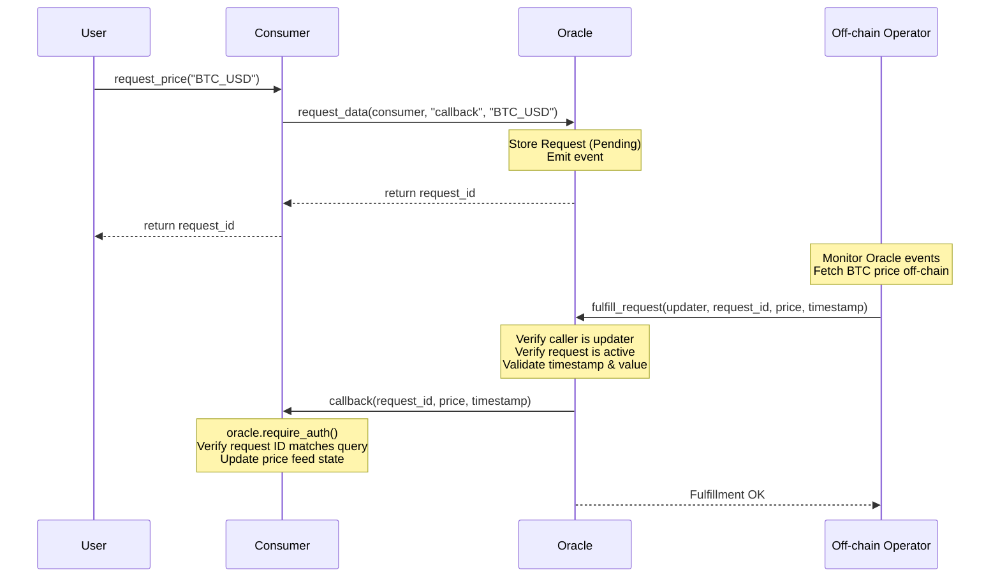

# Oracle Integration Pattern

This example demonstrates a generic, secure **asynchronous request/response oracle integration pattern** in Soroban. It provides a complete template for how dApps can request off-chain data (such as asset prices or sports scores) and receive verified data via a contract callback.

## Architecture

The pattern consists of two primary smart contracts working together:

1. **Oracle Contract (`OracleContract`)**:
   - Manages configuration (`admin`, `updater`, `max_age`, and request `timeout`).
   - Registers data requests and assigns unique, incremental request IDs.
   - Accepts data fulfillment from the authorized `updater` address.
   - Validates data freshness and parameters before calling back the consumer.

2. **Consumer Contract (`ConsumerContract`)**:
   - Stores the registered `OracleContract` address.
   - Initiates data requests by calling `request_data` on the oracle.
   - Exposes a callback function (`callback`) invoked by the Oracle.
   - Authenticates the Oracle call using `require_auth` to prevent unauthorized execution.

### Sequence Diagram



---

## Key Features & Security Design

### 1. Dynamic Callbacks
The Oracle dynamically invokes the callback function specified during the request:
```rust
env.invoke_contract::<()>(
    &request.consumer,
    &request.callback_fn,
    (request_id, value, timestamp).into_val(&env),
);
```

### 2. Callback Caller Verification
To prevent malicious actors from triggering callbacks directly with forged data, the consumer contract validates that the caller is the trusted oracle:
```rust
let oracle: Address = env.storage().instance().get(&ConsumerDataKey::Oracle).unwrap();
oracle.require_auth();
```
*Note: In Soroban, calling `oracle.require_auth()` on the contract address `oracle` checks that the oracle contract is in the call stack/is the caller, which is automatically true if the oracle contract invoked the consumer.*

### 3. Expiration checks
To prevent the fulfillment of stale requests (e.g., if the off-chain operator was down for too long), requests expire after a configured `request_timeout` interval.

### 4. Timestamp & Value Validation
Fulfillment inputs undergo strict validation on the oracle side:
- Submissions must not have future timestamps: `timestamp <= env.ledger().timestamp()`.
- Data must be fresh: `ledger_timestamp - timestamp <= max_age`.
- Data must be newer than the request time: `timestamp >= request_timestamp`.
- The value must be positive (e.g. valid asset prices): `value > 0`.

### 5. Reentrancy & Replay Protection
A request's status changes from `Pending` to `Fulfilled` (or `Expired` if timed out) before the callback is executed. This prevents double-fulfillment and reentrancy attacks.

---

## Verification & Testing

To run the unit tests and inspect code health:

```bash
# Run unit tests
cargo test -p oracle-integration

# Run clippy checks
cargo clippy --workspace --all-targets -- -D warnings

# Build the release WASM target
cargo build --target wasm32-unknown-unknown --release -p oracle-integration
```
