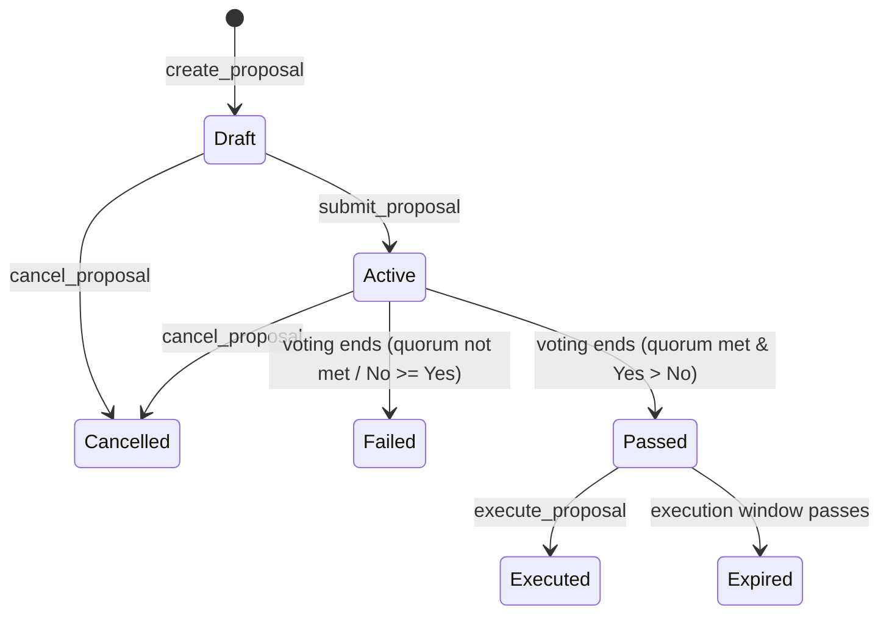

# Proposal Lifecycle

A comprehensive Soroban smart contract demonstrating the end-to-end lifecycle of a governance proposal. This contract manages draft creation, submission, voting, execution via cross-contract calls, cancellation, and expiration.

## Overview

This contract implements a complete proposal workflow with distinct stages, explicit state transitions, validation checks, and automatic expiration handling:

1. **Draft**: The proposal is created by a proposer with a description, target contract, action, and arguments. Only the proposer can modify or submit it.
2. **Active**: The proposer submits the draft to open voting. Users can vote "Yes" or "No".
3. **Passed**: The voting period ends, quorum is met, and Yes votes exceed No votes.
4. **Failed**: The voting period ends, but quorum was not met or No votes exceeded Yes votes.
5. **Executed**: The passed proposal's target contract action is called via cross-contract execution.
6. **Cancelled**: The draft or active proposal is cancelled by the proposer or admin.
7. **Expired**: The proposal was passed but not executed within the allowed execution window.

## Key Concepts

- **State Transitions**: Validates state at each step and prevents invalid transitions (e.g., executing a failed/active proposal).
- **Dynamic State Resolution**: Avoids stale storage states by dynamically computing the proposal's state based on the current ledger sequence and voting thresholds.
- **Cross-Contract Execution**: Executes the target contract's action dynamically using `env.invoke_contract(...)` upon successful proposal passage.
- **Quorum Enforcement**: A configurable minimum voting weight that must be reached for a proposal to pass.

## Proposal State Machine



## Build

```bash
# From this directory
cargo build --target wasm32-unknown-unknown --release

# Or from the repository root
cargo build -p proposal-lifecycle --target wasm32-unknown-unknown --release
```

## Test

```bash
# From this directory
cargo test

# Or from the repository root
cargo test -p proposal-lifecycle
```

Tests live in `src/test.rs` and cover:
- Contract initialization and admin setup.
- Successful draft creation and validation.
- Unauthorized submissions and voting checks.
- Double voting prevention.
- Quorum checks (both met and not met scenarios).
- Dynamic expiration transitions.
- Successful cross-contract call execution.
- Cancellation by proposer/admin and unauthorized cancellation failures.
